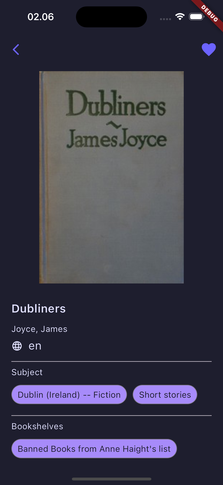

# Gutenberg Tome

## Flutter Version

```
Flutter 3.22.2 • channel stable • https://github.com/flutter/flutter.git
Framework • revision 761747bfc5 (3 weeks ago) • 2024-06-05 22:15:13 +0200
Engine • revision edd8546116
Tools • Dart 3.4.3 • DevTools 2.34.3
```

## How To Run

```
flutter pub get
flutter pub add realm
dart run realm install
flutter pub run build_runner build --delete-conflicting-outputs
flutter run
```

## Library

| Library                                                               | Purpose                                   |
| --------------------------------------------------------------------- | ----------------------------------------- |
| [fluter_bloc](https://pub.dev/packages/flutter_bloc)                  | State Management                          |
| [cached_network_image](https://pub.dev/packages/cached_network_image) | Display network image                     |
| [dio](https://pub.dev/packages/dio)                                   | Network helper                            |
| [fpdart](https://pub.dev/packages/fpdart)                             | Functional programming types and patterns |
| [freezed](https://pub.dev/packages/freezed)                           | Code generator for data-classes           |
| [get_it](https://pub.dev/packages/get_it)                             | Service Locator                           |
| [injectable](https://pub.dev/packages/injectable)                     | Service locator code generator            |
| [intl](https://pub.dev/packages/intl)                                 | Internationalization and Localization     |
| [realm](https://pub.dev/packages/realm)                               | Local Database                            |

## Screenshot

[](./screenshoot/1.png)
[](./screenshoot/2.png)
